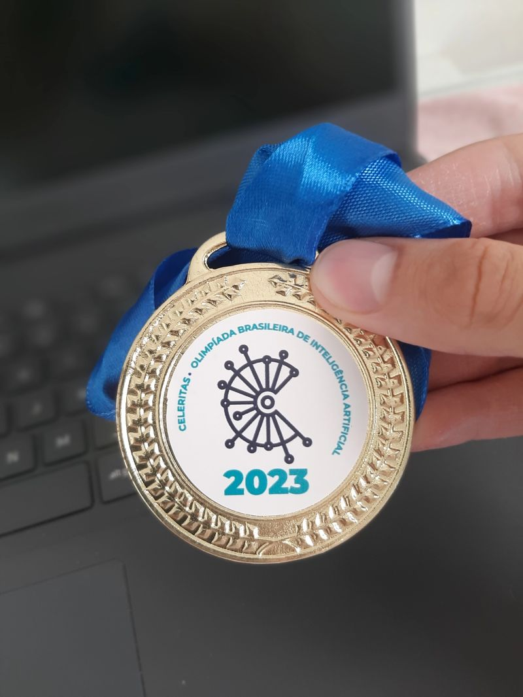

# 2ª Fase da Celeritas
A Olimpíada Brasileira de Inteligência Artificial (Celeritas) é uma competição que tem a missão de instigar a pesquisa e debate sobre inteligência artificial no Brasil. É através do fomento à inovação, praticidade, rapidez e força, que queremos promover a reflexão acerca de como é possível transformar o mundo atual, estimulando soluções criativas para os problemas cotidianos.

## sobre o Problema da Edição

Uma cidade turística do Brasil disponibilizou dados de crimes contra o patrimônio (roubos e furtos), coletados diariamente durante os últimos 12 meses, os quais devem ser utilizados para a construção de um modelo capaz de prever se os turistas estão ou não estão em regiões perigosas e sujeitas a pequenos delitos. A planilha de treinamento fornecida tem 8000 instâncias (linhas) e 20 características das instâncias (colunas).

## Dados

A Figura 1 apresenta um pedaço do conjunto de treinamento. A coluna id identifica cada uma das instâncias individualmente, apresentando valores de 0 a 5600. A coluna target apresenta valores 1 para instâncias que representam regiões perigosas, caso contrário, apresenta valores 0 para instâncias que representam regiões não perigosas. As outras colunas, contendo números reais, representam dados das regiões que devem embasar a decisão.

Após treinar o modelo, foi realizado a predição na planilha de teste. A planilha de teste fornecida tem 2400 instâncias (linhas) e 20 características das instâncias (colunas). Ela contém informações semelhantes à planilha de treinamento, mas é fornecida sem os rótulos, ou seja, se as regiões são ou não são perigosas.

## Saldo :)

